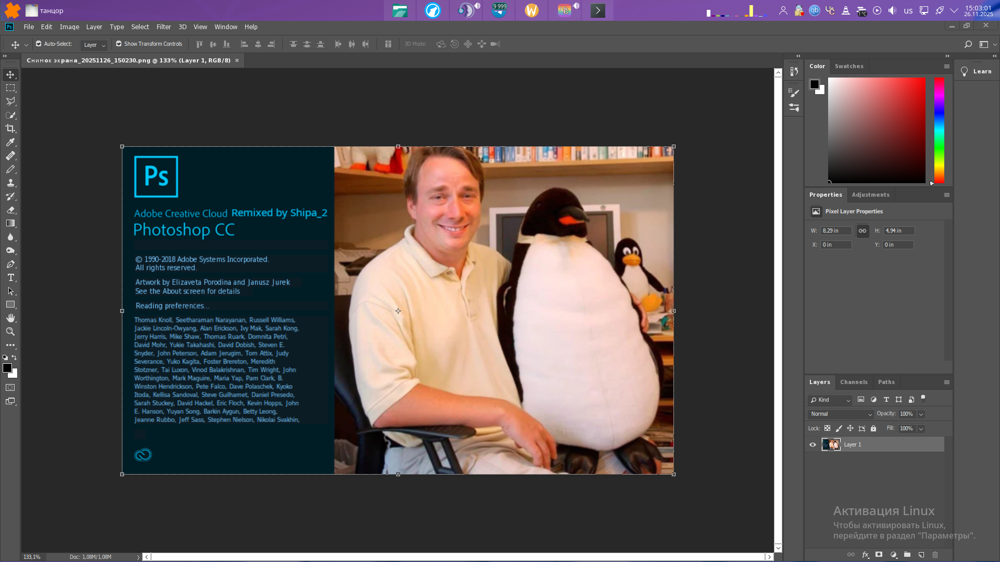

<div align="center" class="tip" markdown="1" style>



    
</div>

# Photoshop CC v19 installer for Linux
This bash script helps you to install Photoshop CC version 19 on your Linux machine using wine behind the scene
and sets some necessary components up for the best performance

## :rocket: Features
* it works (OMG)
* creates photoshop desktop entry
* supports graphic cards (WOW)
* it's free and you not need license key
* works on Linux

## List of deps:
* wine
* wine-mono
* wine-gecko
* winetricks
* lolcat :D
* md5sum

or just...
```bash
sudo pacman -Syyu lolcat wine winetricks wine-mono wine-gecko
```

## :warning: You will need
1. 64bit distro (asus eee pc 701 unsupported)

2. more than 3 braincells

3. at least 5GB in your /home directory (or you can use -d /path/to/dir(broken btw))

4. internet connection and about 40 minutes

## :computer: Installation
1. clone this repo

```bash
git clone https://github.com/shipa-2/photoshopCClinux-Remixed.git && cd photoshopCClinux-Remixed
```
2. run installer

```bash
chmod +x setup.sh && ./setup.sh
```
3. select "Install Photoshop CC"


<div align="center" class="tip" markdown="1" style>


</div>

4. all done, just wait

## :hammer: Tools

<summary>:sparkles: Liquify Tools</summary>
as you know photoshop has many useful tools like `Liquify Tools`.</br>

if you get some errors while working with these tools,
It may because of the graphics card.</br>

photoshop uses the `GPU` to process these tools so before using these tools make sure that your graphics card `(Nvidia, AMD)` is configured correctly in your Linux machine.
</br>The other solution is you can configure photoshop to use your `CPU` for image processing. to do that, follow the steps below:

* go to edit tab and open `preferences` or `[ctrl+K]`
* then go to the `performance` tab
* in the graphics processor settings section, uncheck `Use graphics processor`


## :hotsprings: Uninstall
You can delete the folder manually, uninstaller is broken

## :bookmark: License


---
